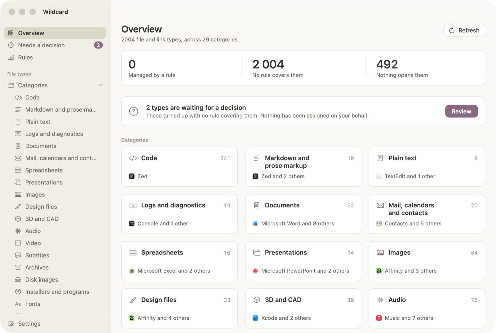
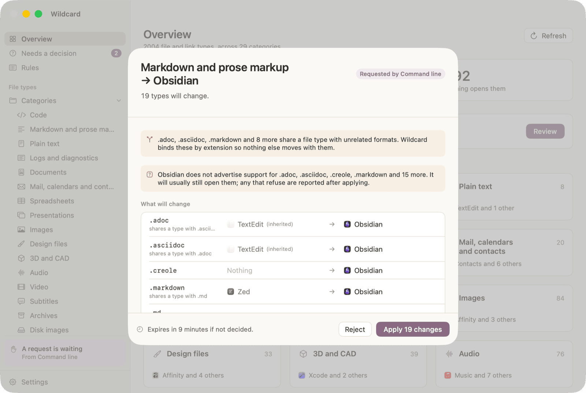

<a id="readme-top"></a>

<!-- PROJECT SHIELDS -->
[![Release][release-shield]][release-url]
[![CI][ci-shield]][ci-url]
[![Downloads][downloads-shield]][release-url]
[![macOS][macos-shield]][release-url]
[![Swift][swift-shield]][swift-url]
[![MIT License][license-shield]][license-url]

<!-- PROJECT LOGO -->
<br />
<div align="center">
  <a href="https://github.com/maksim-shabunov/wildcard">
    
  </a>

  <h1 align="center">Wildcard</h1>

  <p align="center">
    Set which app opens which kind of file on macOS — a whole category at a time.
    <br />
    Every change, whether it comes from you or from an AI agent, is a diff you approve first.
    <br />
    <br />
    <a href="#installation"><strong>Install Wildcard »</strong></a>
    <br />
    <br />
    <a href="#usage">Usage</a>
    &middot;
    <a href="https://github.com/maksim-shabunov/wildcard/issues/new?template=bug_report.yml">Report Bug</a>
    &middot;
    <a href="https://github.com/maksim-shabunov/wildcard/issues/new?template=feature_request.yml">Request Feature</a>
  </p>
</div>

<!-- TABLE OF CONTENTS -->
<details>
  <summary>Table of Contents</summary>
  <ol>
    <li>
      <a href="#about-the-project">About The Project</a>
      <ul>
        <li><a href="#what-it-does">What it does</a></li>
        <li><a href="#built-with">Built With</a></li>
      </ul>
    </li>
    <li>
      <a href="#getting-started">Getting Started</a>
      <ul>
        <li><a href="#prerequisites">Prerequisites</a></li>
        <li><a href="#installation">Installation</a></li>
        <li><a href="#build-from-source">Build from source</a></li>
      </ul>
    </li>
    <li>
      <a href="#usage">Usage</a>
      <ul>
        <li><a href="#the-approval-gate">The approval gate</a></li>
        <li><a href="#command-line">Command line</a></li>
        <li><a href="#ai-agents-mcp">AI agents (MCP)</a></li>
      </ul>
    </li>
    <li><a href="#privacy-and-security">Privacy and security</a></li>
    <li><a href="#contributing">Contributing</a></li>
    <li><a href="#license">License</a></li>
    <li><a href="#contact">Contact</a></li>
    <li><a href="#acknowledgments">Acknowledgments</a></li>
  </ol>
</details>

<!-- ABOUT THE PROJECT -->
## About The Project

<picture>
  <source media="(prefers-color-scheme: dark)" srcset="docs/images/overview-dark.png">
  <source media="(prefers-color-scheme: light)" srcset="docs/images/overview-light.png">
  
</picture>

macOS lets you change a default application one file extension at a time, through
Get Info → Change All. Moving your code to a new editor that way means finding
`.ts`, `.tsx`, `.rs`, `.toml`, `.gradle`, `.podspec` and three hundred others —
one dialog each, and you will still miss the ones you have never heard of.

Wildcard works in categories. Pick **Code**, pick your editor, and all 341
extensions move together. Then it stays out of the way and tells you when
something changes them back.

<p align="right">(<a href="#readme-top">back to top</a>)</p>

### What it does

* **Categories.** 1,135 file extensions and link schemes, curated into 29
  categories — Code, Images, Archives, Web links, and so on. You never type an
  extension list by hand.
* **Rules.** "Code opens with Cursor" as a standing intent. A rule changes
  nothing on its own; it exists so Wildcard can tell you when an installer
  quietly takes `.json` back — which otherwise only surfaces as the wrong app
  launching a week later.
* **Needs a decision.** A file type that appears on your Mac with nothing
  deciding where it should go waits in an inbox, instead of going to whichever
  app claimed it first.
* **History and undo.** Every applied change is listed with what it changed.
  <kbd>⌘</kbd><kbd>Z</kbd> undoes the last one, and a full snapshot is taken
  before every change, so there is always a way back.
* **Links too.** Which browser opens `https`, which client opens `mailto`, which
  editor opens `vscode://` — the same categories, the same approval.

<p align="right">(<a href="#readme-top">back to top</a>)</p>

### Built With

[![Swift][swift-badge]][swift-url]
[![SwiftUI][swiftui-badge]][swiftui-url]
[![MCP][mcp-badge]][mcp-url]

**No third-party dependencies.** The JSON-RPC server, the argument parser and the
TOML editing are all written out longhand, so `git clone && swift build` fetches
nothing and the whole supply chain is in this repository.

<p align="right">(<a href="#readme-top">back to top</a>)</p>

<!-- GETTING STARTED -->
## Getting Started

### Prerequisites

macOS 14 (Sonoma) or later. One universal build covers both Apple Silicon and
Intel. Nothing else to install.

### Installation

Homebrew:

```sh
brew install --cask maksim-shabunov/tap/wildcard
```

Or one line, no Homebrew required:

```sh
curl -fsSL https://raw.githubusercontent.com/maksim-shabunov/wildcard/main/install.sh | bash
```

Either one puts `Wildcard.app` in `/Applications`. Run it again to update. The
install script verifies the release against the SHA-256 published beside it
before unpacking anything.

> [!NOTE]
> Wildcard is signed ad-hoc rather than with a paid Apple Developer certificate,
> so it cannot be notarised. Both commands above account for that and neither
> leaves you with a warning to click through. If you download the `.zip` from
> [Releases][release-url] in a browser instead, macOS quarantines it — clear that
> with `xattr -dr com.apple.quarantine /Applications/Wildcard.app`, or build from
> source, which is never quarantined.

### Build from source

```sh
git clone https://github.com/maksim-shabunov/wildcard.git
cd wildcard
swift test      # 23 tests, about a fifth of a second
./build.sh      # assembles, signs and installs to ~/Applications
```

Xcode 16 or a Swift 6 toolchain. `./build.sh --help` lists the rest.

<p align="right">(<a href="#readme-top">back to top</a>)</p>

<!-- USAGE -->
## Usage

Open a category, choose an application, and approve the change. That is the whole
loop, and it is the same loop for the command line and for an agent.

### The approval gate

<picture>
  <source media="(prefers-color-scheme: dark)" srcset="docs/images/proposal-dark.png">
  <source media="(prefers-color-scheme: light)" srcset="docs/images/proposal-light.png">
  
</picture>

Every change becomes a **proposal**: a diff you read and approve. There is no
auto-apply setting, because there is no code path that skips this sheet.

```text
  you, the CLI, or an agent
            │
            ▼
      a proposal ──────▶ the window shows the full diff
                                    │
                          you press Apply
                                    │
                                    ▼
                  snapshot → write → reload → read back and verify
```

The last step is the one that matters. Wildcard reads the change back out of
LaunchServices and reports what actually took effect, rather than assuming the
write worked. Proposals expire after ten minutes, and a request that arrives from
outside the window deliberately does not accept <kbd>Return</kbd> as approval.

### Command line

The app ships a `wildcard` binary. Link it from **Settings → Integrations**, or
call it at `/Applications/Wildcard.app/Contents/Helpers/wildcard`.

```sh
wildcard status                          # what is managed, drifting, unhandled
wildcard list --category code            # what opens what
wildcard search kotlin                   # find types by name or extension
wildcard set --app Zed --category code   # shows the diff, waits for approval
wildcard set --app Zed --types kt,rs --print-only   # just show me
wildcard history
```

Writes queue a proposal and block until you approve it in the window. Add
`--json` to any command for machine-readable output.

### AI agents (MCP)

Wildcard is a [Model Context Protocol][mcp-url] server. **Settings →
Integrations** installs it into Claude Code, Claude Desktop or Codex, or hands
you the config block to paste anywhere else.

```text
› move my code files to Zed but leave markdown in Obsidian

  Wildcard is asking you to approve 337 changes.
```

Agent access is **off by default**. Switched on, an agent gets seventeen tools:
eleven that only read, three that edit Wildcard's own rules — which changes no
file associations by itself — and three that queue a proposal and return.

An agent cannot approve its own proposal. There is no setting for it, and the
check lives in the binary rather than only in the MCP layer, because an agent
with a shell can run that binary directly.

<p align="right">(<a href="#readme-top">back to top</a>)</p>

<!-- PRIVACY AND SECURITY -->
## Privacy and security

Wildcard makes no network calls, has no telemetry, and contains no AI of its own.

It writes to exactly two places: its own folder at
`~/Library/Application Support/Wildcard/`, and the LaunchServices preference file
that stores your default applications. Its own state is plain JSON — rules,
history, snapshots and the queue of pending proposals — readable and editable by
hand, because an app whose job is to make an opaque part of the system legible
should not be opaque itself.

Every release publishes a SHA-256 beside its archive. To report a vulnerability,
open a [security advisory][security-url] rather than a public issue.

<p align="right">(<a href="#readme-top">back to top</a>)</p>

<!-- CONTRIBUTING -->
## Contributing

Contributions are welcome. The easiest place to help is the catalog: if a file
type you use is missing from
[`catalog.json`](Sources/WildcardKit/Catalog/Resources/catalog.json), adding it
is one line.

1. Fork the project
2. Create your branch (`git checkout -b feature/amazing-feature`)
3. Commit your changes (`git commit -m 'Add some amazing feature'`)
4. Push to the branch (`git push origin feature/amazing-feature`)
5. Open a pull request

One rule governs the rest: nothing may reach LaunchServices except through a
proposal a person approved. A pull request adding a second path, a `--yes` flag
or an auto-approve setting will be declined however convenient it is. See
[CONTRIBUTING.md](CONTRIBUTING.md) for the build, the test layout and the release
process.

<p align="right">(<a href="#readme-top">back to top</a>)</p>

<!-- LICENSE -->
## License

Distributed under the MIT License. See [`LICENSE`](LICENSE) for more information.

<p align="right">(<a href="#readme-top">back to top</a>)</p>

<!-- CONTACT -->
## Contact

Maksim Shabunov — [@maksim-shabunov](https://github.com/maksim-shabunov)

Project link: [https://github.com/maksim-shabunov/wildcard](https://github.com/maksim-shabunov/wildcard)

<p align="right">(<a href="#readme-top">back to top</a>)</p>

<!-- ACKNOWLEDGMENTS -->
## Acknowledgments

* [duti](https://github.com/moretension/duti) and
  [SwiftDefaultApps](https://github.com/Lord-Kamina/SwiftDefaultApps) — prior art
  for writing the LaunchServices preference domain directly, which is the only
  approach that survives assigning hundreds of types at once
* [Best-README-Template](https://github.com/othneildrew/Best-README-Template) —
  the shape of this file
* [Shields.io](https://shields.io) — the badges
* [Model Context Protocol](https://modelcontextprotocol.io) — the agent interface

<p align="right">(<a href="#readme-top">back to top</a>)</p>

<!-- MARKDOWN LINKS & IMAGES -->
[release-shield]: https://img.shields.io/github/v/release/maksim-shabunov/wildcard?style=for-the-badge&color=8A6A82&labelColor=1F1E1D
[release-url]: https://github.com/maksim-shabunov/wildcard/releases/latest
[ci-shield]: https://img.shields.io/github/actions/workflow/status/maksim-shabunov/wildcard/ci.yml?branch=main&style=for-the-badge&label=CI&labelColor=1F1E1D
[ci-url]: https://github.com/maksim-shabunov/wildcard/actions/workflows/ci.yml
[downloads-shield]: https://img.shields.io/github/downloads/maksim-shabunov/wildcard/total?style=for-the-badge&color=8A6A82&labelColor=1F1E1D
[macos-shield]: https://img.shields.io/badge/macOS-14%2B-000000?style=for-the-badge&logo=apple&logoColor=white&labelColor=1F1E1D
[license-shield]: https://img.shields.io/github/license/maksim-shabunov/wildcard?style=for-the-badge&color=8A6A82&labelColor=1F1E1D
[license-url]: https://github.com/maksim-shabunov/wildcard/blob/main/LICENSE
[security-url]: https://github.com/maksim-shabunov/wildcard/security/advisories/new
[swift-shield]: https://img.shields.io/badge/Swift-6-F05138?style=for-the-badge&logo=swift&logoColor=white&labelColor=1F1E1D
[swift-badge]: https://img.shields.io/badge/Swift-F05138?style=for-the-badge&logo=swift&logoColor=white
[swift-url]: https://swift.org
[swiftui-badge]: https://img.shields.io/badge/SwiftUI-0071E3?style=for-the-badge&logo=swift&logoColor=white
[swiftui-url]: https://developer.apple.com/xcode/swiftui/
[mcp-badge]: https://img.shields.io/badge/Model%20Context%20Protocol-000000?style=for-the-badge&logoColor=white
[mcp-url]: https://modelcontextprotocol.io
